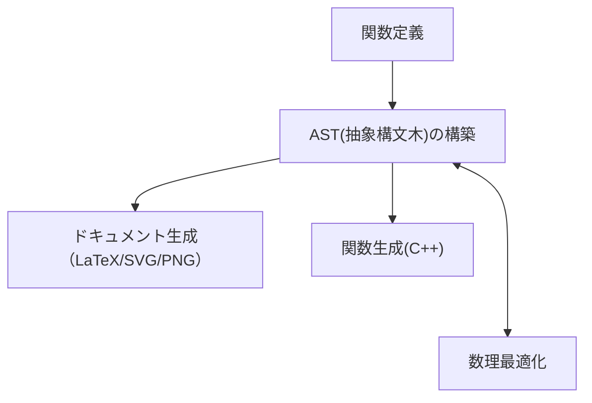

# SymCelerator
## TL;DR
変数としてのシンボルを用いた関数定義ができるライブラリです。
ドキュメント生成機能も備えています。
```
pip install git+https://github.com/ueda-dev/SymCelerator
```
```{python}
from symcelerator import Symbol, symcelerate

a = Symbol('a', '変数1')
b = Symbol('b', '変数2')
func = symcelerate(a + 2 * b)

func(1, 2) #>>> 5
func.latex() #>>> 'a + 2 \times b'
```

## 利用可能な数学関数
現状では`abs()`のみサポートしています。主要な数学関数のサポートは今後やっていこうと思います。

## 仕組み


>[!TIP]  
>for文でループを回したいときは`symcelerate_vectorized()'を利用して関数をベクトル化することを推奨。  
>ベクトル化していない関数をfor文で回すと素のPythonよりもパフォーマンスが落ちます。

>[!WARNING]  
>趣味で作ったライブラリなのであまりメンテしないかもです。   
>( 「算術演算系の特殊メソッドで構文木がつくれるぞ！うおおお」くらいのノリで作りました)  
>遊び半分で見てね～